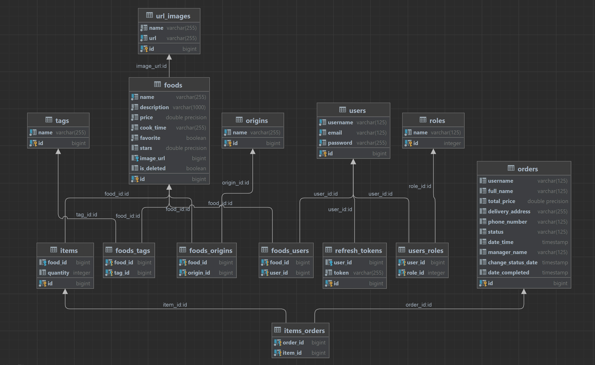

   <h1>Food Store</h1>

<h2>Program description</h2>

   
The program is a demonstration version of an online food ordering store. 
Please note that the interface language is English, the search is carried out 
by name in English.

   
You can test this application by following the link:
http://demospring.eu-central-1.elasticbeanstalk.com/

<h2>Technologies Used</h2>
<ul>
<li>Angular 16</li>
<li>Java 17</li>
<li>Maven</li>
<li>Spring 3.0.6</li>
<li>Spring Data</li>
<li>Hibernate</li>
<li>Spring MVC (REST)</li>
<li>Spring Security JWT</li>
<li>PostgreSQL</li>
<li>Lombok</li>
<li>Amazon RDS</li>
<li>Amazon S3</li>
<li>AWS Elastic Beanstalk</li>
</ul>

<h2>Video clip</h2>

<video width="320" height="240" controls>
  <source src="./assets/clip.mp4" type="video/mp4">
</video>

<h2>Screenshots</h2>

<h3>Main page</h3>

<h3>Filtering foods by tag</h3>

<h3>Search foods by keyword in the title</h3>

<h3>Food page for a non-logged user</h3>

<h3>Food page for logged in users</h3>

<h3>Food ordering page</h3>

<h3>Manager page</h3>

<h3>Page for adding a new food item</h3>

<h3>Database Diagram</h3>

 

<h3>Some Entities</h3>

 

<h3>Testing JWT authentication by Postman</h3>

 

