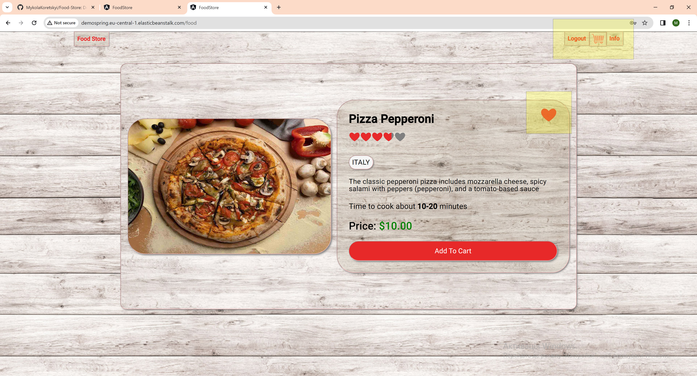

   <h1>Food Store</h1>

<h2>Program description</h2>

   
The program is a demonstration version of an online food ordering store. 
Please note that the interface language is English, the search is carried out 
by name in English.

   
You can test this application by following the link:
http://demospring.eu-central-1.elasticbeanstalk.com/

<h2>Technologies Used</h2>
<ul>
<li>Angular 16</li>
<li>Java 17</li>
<li>Maven</li>
<li>Spring 3.0.6</li>
<li>Spring Data</li>
<li>Hibernate</li>
<li>Spring MVC (REST)</li>
<li>Spring Security JWT</li>
<li>PostgreSQL</li>
<li>Lombok</li>
<li>Amazon RDS</li>
<li>Amazon S3</li>
<li>AWS Elastic Beanstalk</li>
</ul>

<h2>Screenshots</h2>

Database Diagram

 

Some Entities

 

Testing JWT authorization by Postman

 
